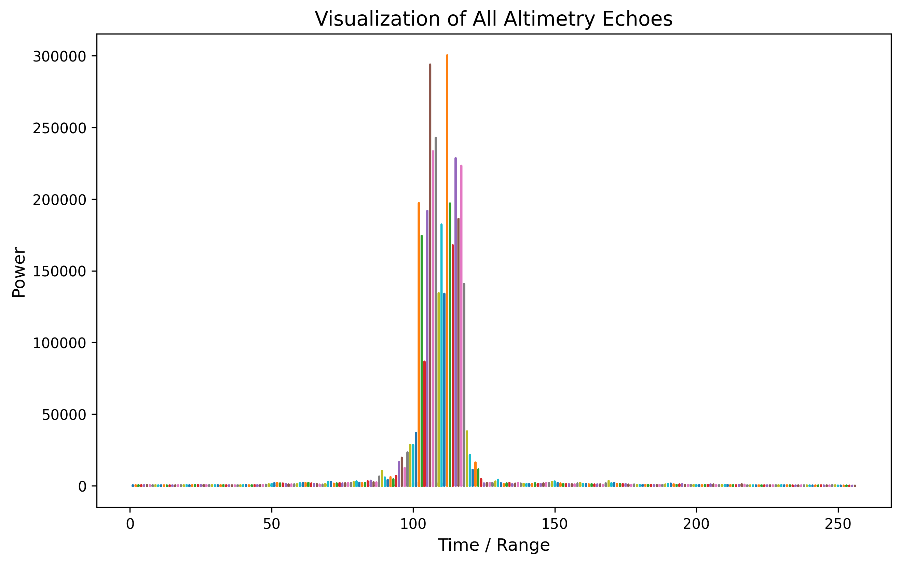
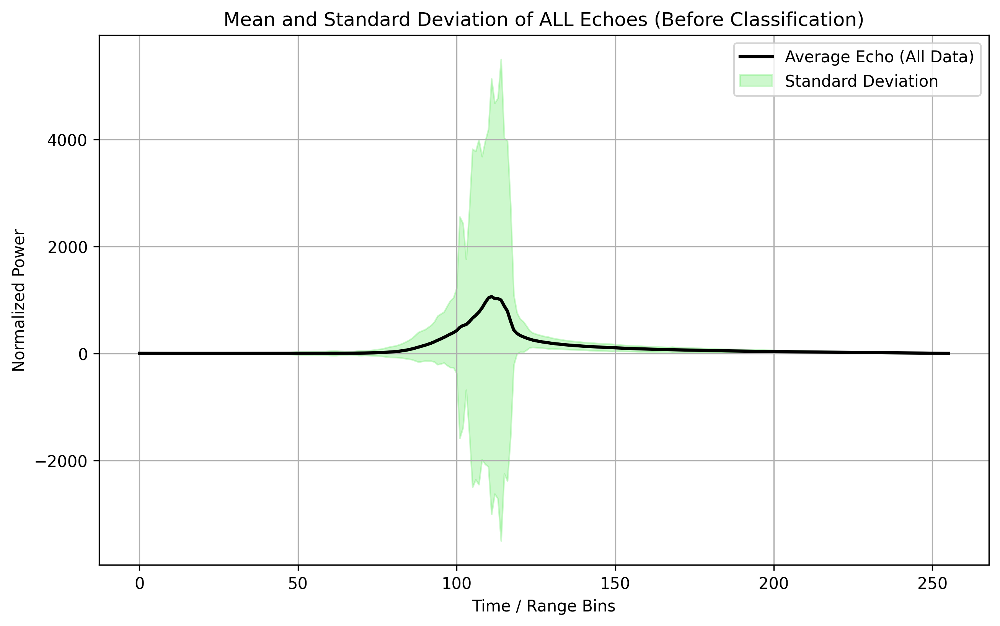
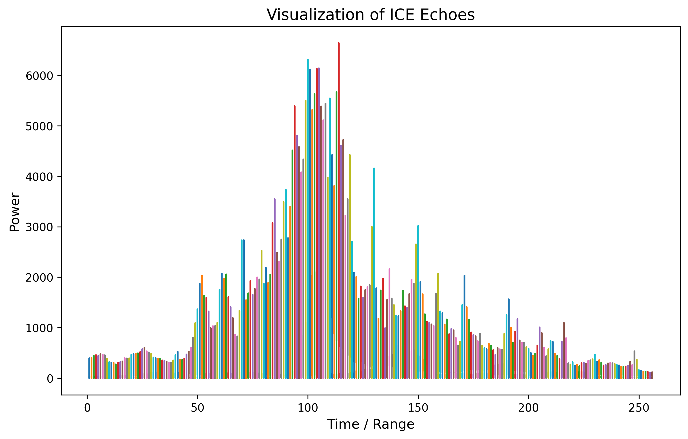
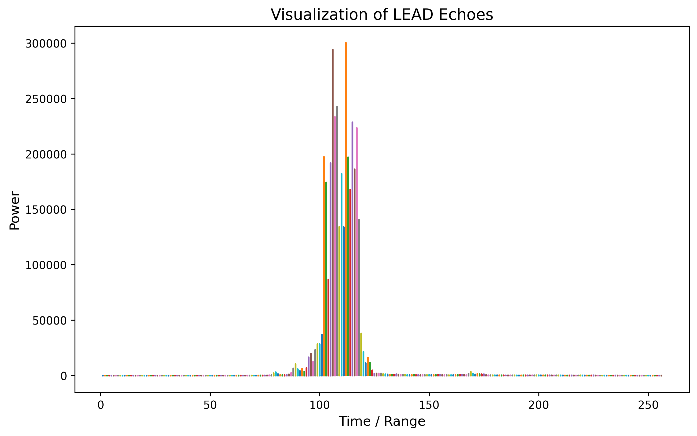
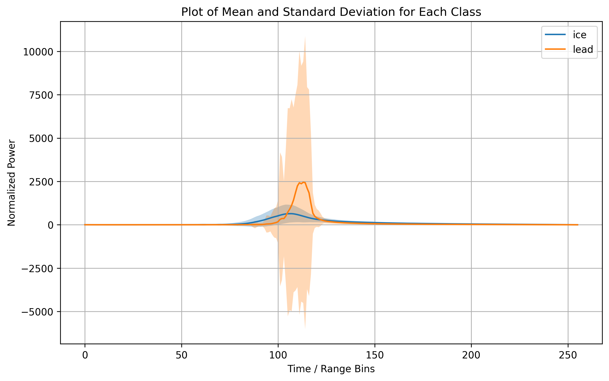
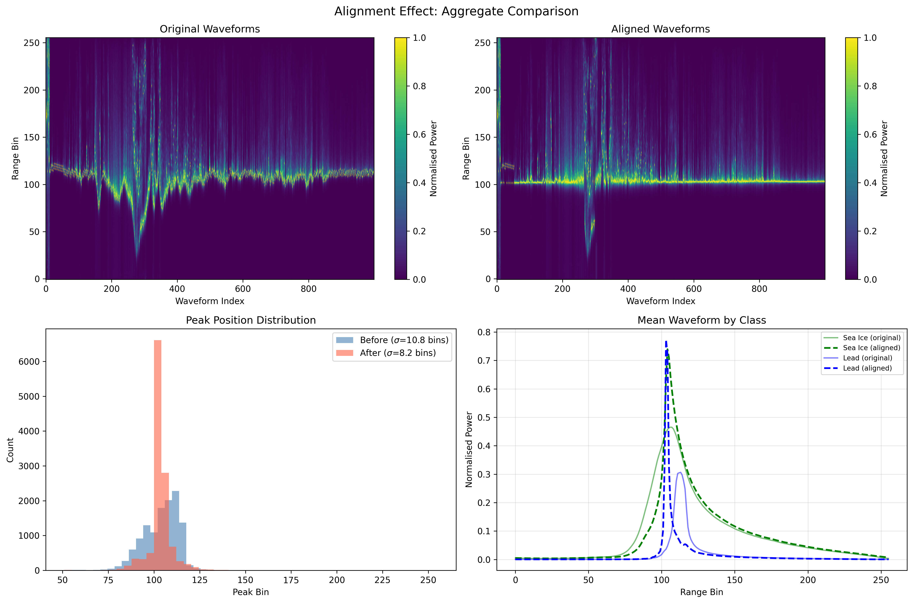
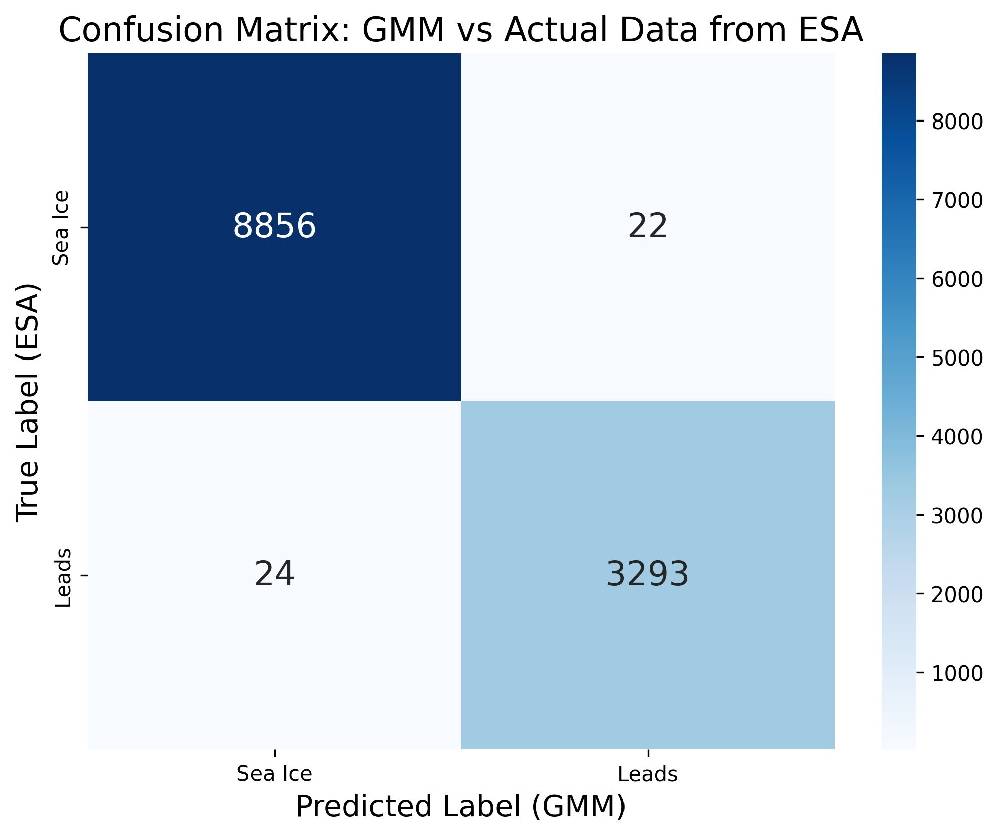

<a id="top"></a>

# GEOL0069 Week 4- Echo Classification (Unsupervised Learning)

## **Table of Contents**
1. [Methods](#methods)
2. [Workflow](#workflow)
3. [Getting Started](#getting-started)
4. [Results](#results)
5. [References](#references)

## **Goal of this week:** 
1) Classify SRAL echoes into lead and sea ice by using unsupervised machine learning methods.
2) Plot mean and standard deviation echo shapes for each class.
3) Evaluate our result against ESA official classification by using a confusion matrix.

## **Link to Full ipynb Notebook**
📓 Notebook: [Chapter1_Unsupervised_Learning_Methods](./Chapter1_Unsupervised_Learning_Methods.ipynb).
You can access the full version of this week's code by clicking above link.

<a id="methods"></a>

## **Methods**
### 1) K-means Clustering 
### ▶ Definition
K-means clustering is a type of unsupervised learning algorithm used for partitioning a dataset into a set of k groups (or clusters), where k represents the number of groups pre-specified by the analyst. It classifies the data points based on the similarity of the features of the data {cite}macqueen1967some. The basic idea is to define k centroids, one for each cluster, and then assign each data point to the nearest centroid, while keeping the centroids as small as possible.

### ▶ Why K-means for Clustering?
- The structure of the data is not known beforehand: K-means doesn’t require any prior knowledge about the data distribution or structure, making it ideal for exploratory data analysis.
- Simplicity and scalability: The algorithm is straightforward to implement and can scale to large datasets relatively easily.

### ▶ Key Components of K-means
1) Choosing K: The number of clusters (k) is a parameter that needs to be specified before applying the algorithm.
2) Centroids Initialization: The initial placement of the centroids can affect the final results.
3) Assignment Step: Each data point is assigned to its nearest centroid, based on the squared Euclidean distance.
4) Update Step: The centroids are recomputed as the center of all the data points assigned to the respective cluster.

### ▶ The Iterative Process of K-means
The assignment and update steps are repeated iteratively until the centroids no longer move significantly, meaning the within-cluster variation is minimised. This iterative process ensures that the algorithm converges to a result, which might be a local optimum.

### ▶ Advantages of K-means
- Efficiency: K-means is computationally efficient.
- Ease of interpretation: The results of k-means clustering are easy to understand and interpret.

### 2) Gaussian Mixture Models (GMM)
### ▶ Definition
Gaussian Mixture Models (GMM) are a probabilistic model for representing normally distributed subpopulations within an overall population. The model assumes that the data is generated from a mixture of several Gaussian distributions, each with its own mean and variance {cite}reynolds2009gaussian, mclachlan2004finite. GMMs are widely used for clustering and density estimation, as they provide a method for representing complex distributions through the combination of simpler ones.

### ▶ Why Gaussian Mixture Models for Clustering?
- Soft clustering is needed: Unlike K-means, GMM provides the probability of each data point belonging to each cluster, offering a soft classification and understanding of the uncertainties in our data.
- Flexibility in cluster covariance: GMM allows for clusters to have different sizes and different shapes, making it more flexible to capture the true variance in the data.

### ▶ Key Components of GMM
1) Number of Components (Gaussians): Similar to K in K-means, the number of Gaussians (components) is a parameter that needs to be set.
2) Expectation-Maximization (EM) Algorithm: GMMs use the EM algorithm for fitting, iteratively improving the likelihood of the data given the model.
3) Covariance Type: The shape, size, and orientation of the clusters are determined by the covariance type of the Gaussians (e.g., spherical, diagonal, tied, or full covariance).

### ▶ The EM Algorithm in GMM
The Expectation-Maximization (EM) algorithm is a two-step process:
1) Expectation Step (E-step): Calculate the probability that each data point belongs to each cluster.
2) Maximization Step (M-step): Update the parameters of the Gaussians (mean, covariance, and mixing coefficient) to maximize the likelihood of the data given these assignments.
This process is repeated until convergence, meaning the parameters do not significantly change from one iteration to the next.

### ▶ Advantages of GMM
- Soft Clustering: Provides a probabilistic framework for soft clustering, giving more information about the uncertainties in the data assignments.
- Cluster Shape Flexibility: Can adapt to ellipsoidal cluster shapes, thanks to the flexible covariance structure.

<p align="right"><a href="#top">⬆ Back to top</a></p>

<a id="workflow"></a>

## **Workflow**
1) Install the necessary package and setup environment.
2) Download data.
3) Implement unsupervised method (GMM) to these data.
4) Obtain result and save,

<a id="getting-started"></a>

## **Getting Started**
### ▶ Where to run this notebook?
- Google Colab. Google colab will provide you access to strong AI training hardware and it would greatly help you to run your code.

### ▶ Environment set up.
- Please run ALL of below code to set up basic environment for this notebook. 
``` python
!pip install rasterio
!pip install netCDF4
!pip install basemap
!pip install cartopy
```
- Please allow access to your google drive while running.
```
from google.colab import drive
drive.mount('/content/drive')
```

### ▶ Want to try GMM and K-Means model on Sentinel-2 Image?
Please download the notebook and navigate to 'K-means Implementation' and 'GMM Implementation' section for detailed code and results. This instruction will be mainly focused on to use GMM to do altimetry classification on sea ice and leads.

<p align="right"><a href="#top">⬆ Back to top</a></p>

<a id="results"></a>

# **Result**
## The result of this notebook includes:
### ▶ All echoes:
Profile of all echoes is obtained by below section of code:
```x = np.stack([np.arange(1,waves_cleaned.shape[1]+1)]*waves_cleaned.shape[0])
plt.plot(x,waves_cleaned)  # plot of all the echoes
```



### ▶ Mean and standard deviation of all the echoes:
Mean and std. is obtained by below section of code:
```
plt.plot(mean_all, label='Average Echo (All Data)', color='black', linewidth=2)
plt.fill_between(range(len(mean_all)),
                 mean_all - std_all,
                 mean_all + std_all,
                 color='#5CE85A', alpha=0.3, label='Standard Deviation')
                
```


### ▶ Separated Diagram for Sea ice and leads.
1) Sea ice echoes profile
The result of seaice class profile is obtained by below code:
```
x = np.stack([np.arange(1,waves_cleaned[clusters_gmm==0].shape[1]+1)]*waves_cleaned[clusters_gmm==0].shape[0])
plt.plot(x,waves_cleaned[clusters_gmm==0])  # plot of all the echoes
plt.show()
```


2) Leads echoes profile
The results of lead class profile is obtained by below code:
```
x = np.stack([np.arange(1,waves_cleaned[clusters_gmm==1].shape[1]+1)]*waves_cleaned[clusters_gmm==1].shape[0])
plt.plot(x,waves_cleaned[clusters_gmm==1])  # plot of all the echoes
plt.show()
```


### ▶ Separated Diagrams of Mean and Standard Deviation for Sea ice and leads.
The result of mean and std. for both class is obtained by below code:
```
mean_ice = np.mean(waves_cleaned[clusters_gmm==0],axis=0)
std_ice = np.std(waves_cleaned[clusters_gmm==0], axis=0)
plt.plot(mean_ice, label='ice')
plt.fill_between(range(len(mean_ice)), mean_ice - std_ice, mean_ice + std_ice, alpha=0.3)
mean_lead = np.mean(waves_cleaned[clusters_gmm==1],axis=0)
std_lead = np.std(waves_cleaned[clusters_gmm==1], axis=0)
plt.plot(mean_lead, label='lead')
plt.fill_between(range(len(mean_lead)), mean_lead - std_lead, mean_lead + std_lead, alpha=0.3)
```


<p align="right"><a href="#top">⬆ Back to top</a></p>


### ▶ Alignment of Waves
Waveform alignment is performed to correct for onboard tracker jitter and geophysical delays, ensuring that the classification model distinguishes surface types based on their true echo shape rather than artificial time-shifts.

Below is the result of waveform alignment.



After physical alignment, the main return is centred at a consistent reference bin across the track, reducing peak-bin spread (lower σ) and producing sharper, more interpretable class-mean waveforms (less peak-smearing), especially for lead echoes.

<p align="right"><a href="#top">⬆ Back to top</a></p>


### ▶ Compare with ESA data (Confusion Matrix)
Confusion matrices provide a concise, standard way to quantify agreement between our predicted classes and the ESA official labels, revealing not only overall correctness but also the type and direction of errors (e.g., sea-ice misclassified as lead and vice versa). The confusion matrix (CM) results are shown below.

In the ESA dataset, sea ice = 1 and lead = 2. Therefore, we need to subtract 1 from it so our predicted labels are comparable with the official product labels. Since GMM cluster labels are arbitrary, we align cluster IDs with physical classes by matching to ESA labels (and flipping labels if necessary).



<a id="references"></a>

## **References**
MacQueen, J. (1967). Some methods for classification and analysis of multivariate observations. Proceedings of the Fifth Berkeley Symposium on Mathematical Statistics and Probability, Volume 1: Statistics, [online] 5.1(1), pp.281–298. Available at: https://projecteuclid.org/ebooks/berkeley-symposium-on-mathematical-statistics-and-probability/Proceedings-of-the-Fifth-Berkeley-Symposium-on-Mathematical-Statistics-and/chapter/Some-methods-for-classification-and-analysis-of-multivariate-observations/bsmsp/1200512992. 

Mclachlan, G.J., Peel, D. and Netlibrary, I. (2000). Finite mixture models. New York: Wiley.

Reynolds, D. (2009). Gaussian Mixture Models. Encyclopedia of Biometrics, pp.659–663. doi:https://doi.org/10.1007/978-0-387-73003-5_196.

<div align="right"><a href="#top">⬆ Back to top</a></div>

## **Contact**
Entao: zcfaew0@ucl.ac.uk

Personal: ddavidw.et@gmail.com

## **Acknowledgments**
For everyone contributed to module GEOL0069.